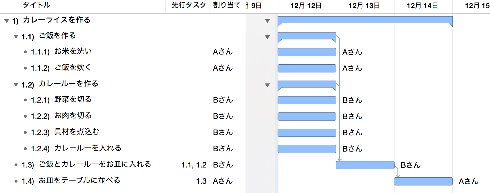
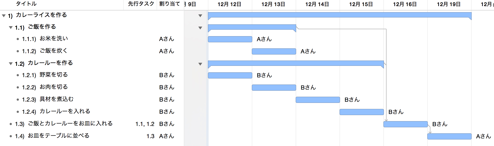

# ガントチャートの決め手は平準化

　「ガントチャートツールってどれを選べば良いの？」と聞かれたら、私は迷わず「平準化ができること」と答えます。ということで、平準化ってナニソレ？となった人向けに、今回は平準化とは何なのか、また何がそんなに嬉しいのかについて書いてみたい思います。

## 目次

１．平準化とは  
２．ガントチャートの平準化が行うこと  
３．平準化はいつ、何のために使うのか  
４．平準化を使うメリットとは  
５．平準化が使えるガントチャートツール  

※そもそもWBSってナニ？という方は[WBSの勘所](https://github.com/lightyield/tech-notes/blob/main/posts/2018/2018-11-18-essentials-of-wbs/index.md)←こちらの記事も合わせてどうぞ。WBSとは何ぞや、から説明しています。

## １．平準化とは

　さて、まずは平準化の定義から。

　需要や業務負荷などが特定の時期や資源に集中しているといった偏りを排し、均等に配分すること。（中略）　プロジェクトマネジメントなどでは、プロジェクトの計画段階で特定の人員にタスクが集中してしまうことがあるが、このままでは実施不可能である。そこでリソースヒストグラムを利用して、作業の平準化を行う。（ITmediaエンタープライズより）

　大きな括りの言葉ではありますが、これから説明する平準化とは、「プロジェクトメンバーの作業を平すこと」を指します。

## ２．ガントチャートの平準化が行うこと

　ガントチャートツールの平準化とは一体どんな機能なのか。まずは平準化を行う前後のガントチャートを見て下さい。

### 平準化する前

### 平準化した後

　平準化を行うことで、メンバーの作業が平されたのが分かります。これは予め設定された1日の作業時間を超えたためであり、結果、コンピューターはメンバーに対する１日当たりの負荷を減らしつつ、プロジェクトの期間が長くなるように変更しています。つまり、平準化とはメンバーの負荷を考えながら、プロジェクト期間をより現実的なものに変えてくれる機能なのです。

## ３．平準化はいつ、何のために使うのか

　平準化を使うタイミングは「いつでも」です。ガントチャートに作業を追加した、変更した、削除した等々、ガントチャートに対して変更が発生した際は常に平準化を行います。また、平準化は何のために使うのか、それは「未来を予測するため」です。

　私はガントチャートツールを「コンピューターに未来を予測してもらうツール」と捉えています。コンピューターに未来を予測してもらうことで、この先のスケジュールを客観的に見るようにするのです。自分でガントチャートを作った場合だと、自分の守備範囲でしか計算が行われません。特に期待値などを含む個人的感情で物事の優先順位が決まるため、結果として実態とはズレた精度の低いスケジュールになってしまうのです。

　平準化機能のないガントチャートツールで計画を立てると、自分が頭に描いた未来予測にしかなりません。自分の考え方が正しいことを前提とした、自分にとって気持ちの良い（キレイな）ガントチャートが生まれるだけなのです。言い換えるなら、自分にとって都合良く作られたスケジュールしか生まれません。

## ４．平準化を使うメリット

　先述の通り、平準化を使うメリットはコンピューターが計算することにあります。自分で考えるのではなく、コンピューターに考えてもらうことで、何度も繰り返し計算を行うことができます。時にはコンピューターが計算することで自分の予想と全く違うことも生まれますが、設定されたパラメータが違っていなければ、これも生まれるべくして生まれた計画なのです。

　平準化を嫌う人の多くは、この予想と違う結果が生まれることを指します。つまり、「自分の思う通りにならないから」という理由ですが、それはちょっと考えものです。私は自分が正しいと過信するのではなく、コンピューターが考えた結果を選択肢の一つとして合わせて検討すべきと考えます。

　実際、私がスケジュールを計画する際は、パラメータの設定に一番時間を使います。そして、その後はコンピュータが計算した結果に従うだけです。もちろん結果を採用するまでの間は、シミュレーションを何度も繰り返し行い、プロジェクトのQCD（品質/コスト/納期）が一番優れた方法を採用します。

## ５．平準化が使えるガントチャートツール

　世の中にはガントチャートツールがたくさんあれど、平準化が行えるツールは意外とありません。私が知る限り以下の２択しか無く、それもOSによって基本的には決定します。

### Microsoft Project

　言わずと知れたガントチャートの王道です。私自身このツールが大好きで、もう10年以上お世話になっています。多彩なパラメータをもとにする平準化は複雑で、未来予測のシミュレーションを行うには打ってつけです。クラウド版、デスクトップ版とアプリケーションの形態も多岐に渡るのですが、残念ながら平準化はデスクトップ版にしか実装されていないようです。

### Omni Plan

　Macユーザー向けのガントチャートツールです。StandardはMacOS版とiOS版の２種類展開で、ProはMacOS版のみの展開です。平準化はStandardに含まれていますので、私は値段の安いこちらを使用しています。このアプリの特徴はなんと言ってもUI。デザインが綺麗で操作も直感的に行えるように工夫されています。ただ、「保存していないのに上書き保存される」「元の状態に戻ろうと操作を取り消しても、変な状態に戻ってしまう」などなど、割と不具合に近い症状が散見されます。品質にいささかの不安がありますので、使用する際は必ずバックアップを取るなど注意をした方が良いでしょう。また余談ですが、アプリには日本語版仕様がありつつも、サポートは英語です。日本語で問い合わせると、翻訳ツールを通したと思われる難解な日本語で返事が返ってきます。

---

　いかがでしたでしょうか。今回の記事が平準化を使ったことがない人、平準化が苦手な人にとって参考になれば幸いです。気に入って頂けた方は「スキ」や「フォロー」のほどお願いします。また「WBSの作り方を教えて欲しい！」という人はこちらの記事も合わせてどうぞ。

　それではまた▷L◁
