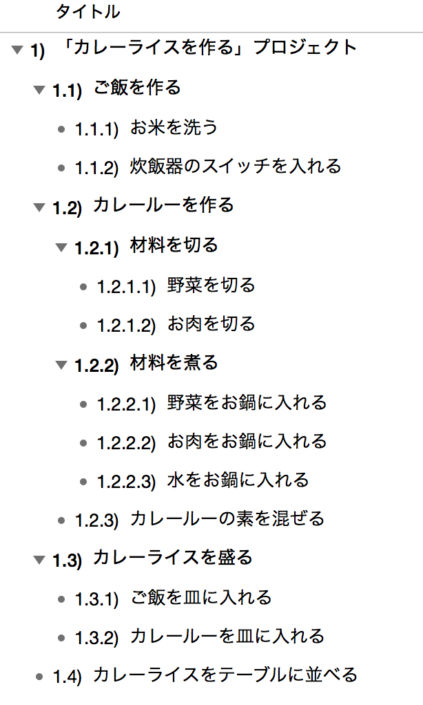
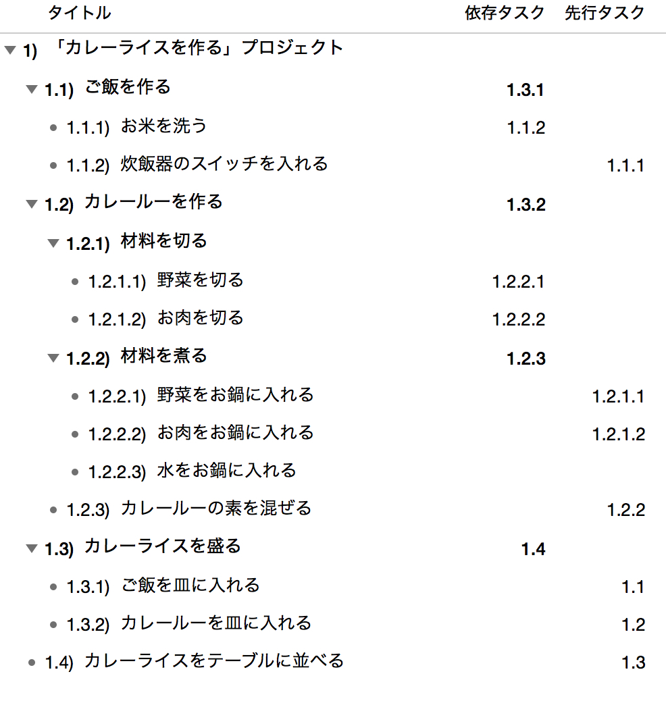

# WBSの勘所

WBSの勘所として、私がWBSを作る際に意識している点をまとめました。

## 目次

1. WBSとは  
2. プロジェクトのゴールを定義する  
3. ゴールまでの作業を洗い出す  
4. 作業を1人日程度の単位に分解する  
5. 作業の依存関係を設定する  
6. WBSを随時更新する  

---

## 1．WBSとは

以下は、[Wikipedia](https://ja.wikipedia.org/wiki/Work_Breakdown_Structure)に記載されたWBSの定義です。

> Work Breakdown Structure (WBS、作業分解構造)は、プロジェクトを理解し管理する上で、プロジェクトの各工程を各担当者の作業レベルまで展開し木構造にまとめたもの。どのレベルまで展開するかはプロジェクトの全メンバーが作業内容を「具体的に○○をする」と理解出来るレベルまでに分解するのが理想であるが、最低でも作業担当者とプロジェクト管理者の理解が得られるレベルまでは必要である。
WBSはガントチャートやPERT図に展開してプロジェクト管理に使われる。

---

## 2．プロジェクトのゴールを定義する

「プロジェクトを理解し管理する上で（云々）」とあるように、WBSはプロジェクトがあってこその構成図です。したがって、まずはプロジェクトのゴール、すなわち目的を設定するところから始めます。

といっても難しいことではなく、関係者に目的やゴールをどう考えているかを確認し、全員がイメージできるゴールを定義します。

例えば「カレーライスを作る」というプロジェクトであれば、そのゴールは「カレーライスを作る」までなのか、「カレーライスをテーブルに並べる」までなのか、「食後の後片付けまで」なのか、といった範囲を決めるイメージです。

---

## 3．ゴールまでの作業を洗い出す

ゴールが決まったら、そこに至るまでの作業を洗い出します。この段階では作業の大小や順序は考えず、ブレーンストーミングのように思いつくままリストアップします。

重要なのは「ゴールに到達する道筋を想像しながら作業を書き出す」ことです。ゴールまでの道筋を描けなければ、プロジェクトは完了できません。粒度は荒くても、この時点で必ずシミュレーションを行います。

「カレーライスを作る」プロジェクトで「ご飯を炊く」作業が抜けてしまうのは致命的です。同じように、実際のプロジェクトでも抜け漏れがないよう注意します。

---

## 4．作業を1人日程度に分解する

洗い出した作業は細かく分解します。目安は1作業あたり1人日程度のボリュームです。1人日程度であれば、工数の妥当性を判断しやすくなります。逆に大きすぎると、その判断が難しくなります。

とはいえ、どうしても1人日単位に分けにくい作業もあります。その場合は無理に分割せず、そのままとします。1人日はあくまで目安であり、ここに時間をかけすぎないことが大切です。

なお、「カレーライスを作る」プロジェクトはすべての作業を合わせても1人日以内で完結するでしょう。このような場合は作業単位を「日」ではなく「時間」に変更します。

---

## 5．作業の依存関係を設定する

作業が出そろったら、それぞれの依存関係を設定します。ある作業が完了しないと着手できない場合もあれば、同時並行で進められる場合もあります。これらの依存関係はプロジェクト期間（クリティカルパス）に大きな影響を与えるため、できる限り洗い出します。

「カレーライスを作る」プロジェクトでは、「ご飯を炊く」と「カレールーを作る」は同時に開始できますが、「お皿に盛り付ける」作業はこの2つが完了していなければ着手できないイメージです。

---

## 6．WBSを随時更新する

「WBSは生き物」です。状況が日々変化する中では、時間の経過とともに作業も変わります。これまで曖昧だった作業も、着手直前には明確になります。

そのため私は、作業に変化が生じたら即座にWBSへ反映するようにしています。その結果、プロジェクト開始前に作成したWBSは粒度が荒く、進行とともに細かくなり、完了時には実際に行った作業の全てが反映される、といった形で成長していきます。

ただし、人月ベースの見積もりを行う場合、開始前に作ったWBSが対外的に使われることが多く、WBSを頻繁に更新すると「計画通りに実行できていない」と見られてしまう場合もあります。

そこで私は、外部向けと内部向けの2種類のWBSを用意します。外部向けは作業を荒くしておくことで、進行中の乖離を誤差の範囲として吸収させます。この粗さ加減は周囲の反応を見ながらバランスを取り、そのレベルでリスクを報告するようにしています。

---

今回はここまでとなります。最後までお読みいただきありがとうございます。
▷L◁